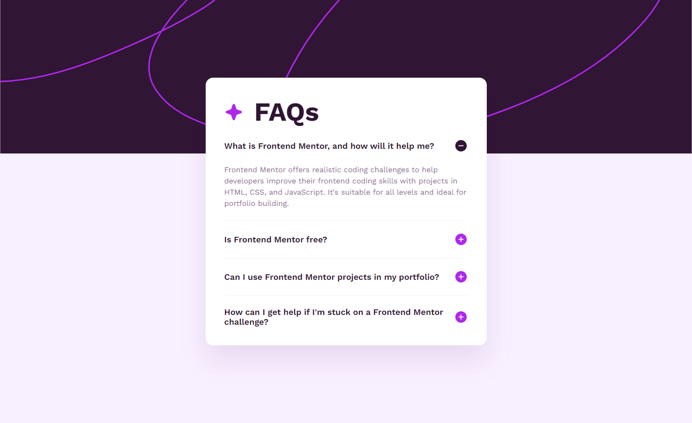

# Frontend Mentor - FAQ accordion solution

This is a solution to the [FAQ accordion challenge on Frontend Mentor](https://www.frontendmentor.io/challenges/faq-accordion-wyfFdeBwBz). Frontend Mentor challenges help you improve your coding skills by building realistic projects.

## Table of contents

- [Overview](#overview)
  - [The challenge](#the-challenge)
  - [Screenshot](#screenshot)
  - [Links](#links)
- [My process](#my-process)
  - [Built with](#built-with)
  - [What I learned](#what-i-learned)
  - [Continued development](#continued-development)
  - [Useful resources](#useful-resources)
- [Author](#author)
- [Acknowledgments](#acknowledgments)

## Overview

### The challenge

Users should be able to:

- Hide/Show the answer to a question when the question is clicked
- Navigate the questions and hide/show answers using keyboard navigation alone
- View the optimal layout for the interface depending on their device's screen size
- See hover and focus states for all interactive elements on the page

### Screenshot

### Links

[Solution URL](https://github.com/Antonvasilache/faq-accordion)  
[Live Site URL](https://faq-accordion-av.netlify.app/)

## My process

1. Creating the static webpage and styling it completely as in the design.For the layout I've used CSS Flexbox.
2. Adding the Javascript functionality for clicking the accordion items.
3. Making only one accordion item stay open.
4. Adding the keyboard navigation.
5. Styling the page for mobile screens.
6. Fixing navigation bugs.

### Built with

- Semantic HTML5 markup
- CSS custom properties
- Flexbox
- JavaScript

### What I learned

- Building an accordion component with Javascript.
- Adding functionality for keyboard navigation.
- Managing the default behaviours of some events.

### Continued development

- Building more simple functional components in Vanilla JS.
- Managing state in a more efficient way.

## Author

- Website - [Antonvasilache.com](https://www.antonvasilache.com)
- Frontend Mentor - [@Antonvasilache](https://www.frontendmentor.io/profile/Antonvasilache)
